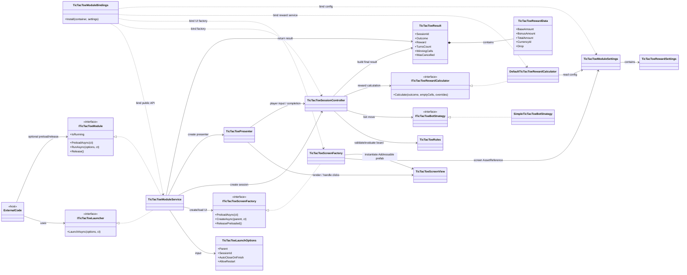

# TicTacToe Module UML

Минимальная диаграмма архитектуры модуля.

```mermaid
classDiagram
direction LR

class ExternalCode {
  <<host>>
}

class TicTacToeModuleBindings {
  +Install(container, settings)
}

class ITicTacToeLauncher {
  <<interface>>
  +LaunchAsync(options, ct)
}

class ITicTacToeModule {
  <<interface>>
  +IsRunning
  +PreloadAsync(ct)
  +RunAsync(options, ct)
  +Release()
}

class TicTacToeModuleService

class TicTacToeLaunchOptions {
  +Parent
  +SessionId
  +AutoCloseOnFinish
  +AllowRestart
}

class ITicTacToeScreenFactory {
  <<interface>>
  +PreloadAsync(ct)
  +CreateAsync(parent, ct)
  +ReleasePreloaded()
}

class TicTacToeScreenFactory

class TicTacToePresenter
class TicTacToeScreenView

class TicTacToeSessionController
class TicTacToeRules

class ITicTacToeBotStrategy {
  <<interface>>
}

class SimpleTicTacToeBotStrategy

class ITicTacToeRewardCalculator {
  <<interface>>
  +Calculate(outcome, emptyCells, overrides)
}

class DefaultTicTacToeRewardCalculator

class TicTacToeModuleSettings
class TicTacToeRewardSettings

class TicTacToeResult {
  +SessionId
  +Outcome
  +Reward
  +TurnsCount
  +WinningCells
  +WasCancelled
}

class TicTacToeRewardData {
  +BaseAmount
  +BonusAmount
  +TotalAmount
  +CurrencyId
  +Drop
}

ExternalCode --> ITicTacToeLauncher : uses
ExternalCode --> ITicTacToeModule : optional preload/release

ITicTacToeLauncher <|.. TicTacToeModuleService
ITicTacToeModule <|.. TicTacToeModuleService

TicTacToeModuleBindings ..> TicTacToeModuleService : bind public API
TicTacToeModuleBindings ..> TicTacToeSessionController : bind factory
TicTacToeModuleBindings ..> TicTacToeScreenFactory : bind UI factory
TicTacToeModuleBindings ..> DefaultTicTacToeRewardCalculator : bind reward service
TicTacToeModuleBindings ..> TicTacToeModuleSettings : bind config

TicTacToeModuleService --> TicTacToeLaunchOptions : input
TicTacToeModuleService --> ITicTacToeScreenFactory : create/load UI
TicTacToeModuleService --> TicTacToeSessionController : create session
TicTacToeModuleService --> TicTacToePresenter : create presenter
TicTacToeModuleService --> TicTacToeResult : return result

ITicTacToeScreenFactory <|.. TicTacToeScreenFactory
TicTacToeScreenFactory --> TicTacToeModuleSettings : screen AssetReference
TicTacToeScreenFactory --> TicTacToeScreenView : instantiate Addressable prefab

TicTacToePresenter --> TicTacToeScreenView : render / handle clicks
TicTacToePresenter --> TicTacToeSessionController : player input / completion

TicTacToeSessionController --> TicTacToeRules : validate/evaluate board
TicTacToeSessionController --> ITicTacToeBotStrategy : bot move
TicTacToeSessionController --> ITicTacToeRewardCalculator : reward calculation
TicTacToeSessionController --> TicTacToeResult : build final result

ITicTacToeBotStrategy <|.. SimpleTicTacToeBotStrategy
ITicTacToeRewardCalculator <|.. DefaultTicTacToeRewardCalculator

DefaultTicTacToeRewardCalculator --> TicTacToeModuleSettings : read config
TicTacToeModuleSettings --> TicTacToeRewardSettings : contains

TicTacToeResult *-- TicTacToeRewardData : contains
```
